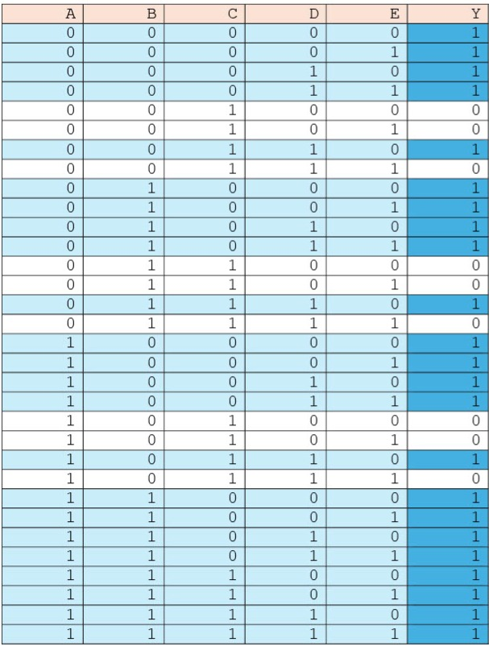

# Week 2: Work on your own
For this week I worked on solving the truth table given to us and implementing it into Hardcaml, where I then flashed it onto the FPGA (NEXYS A7). The soultion is provided in this readme, albeit a little messy, but none the less correct.

## Overview: 
  Here is the truth table: 

  

div>
