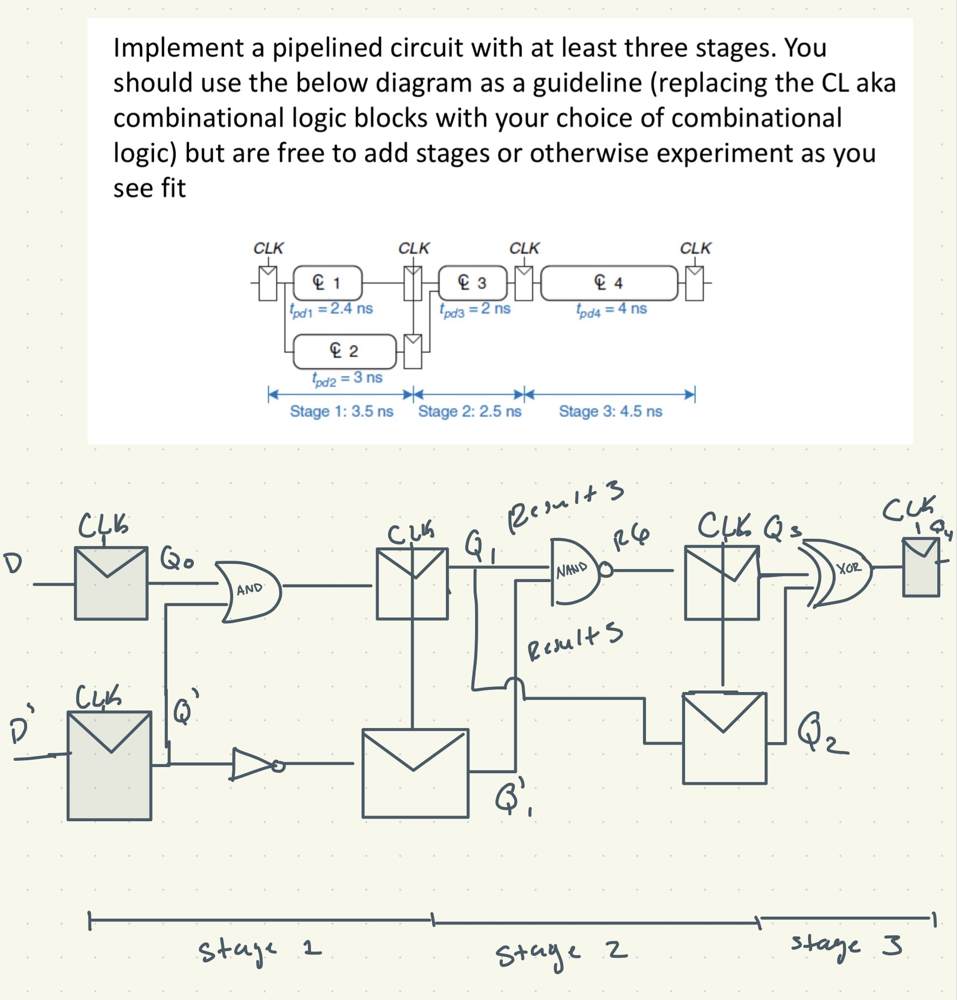
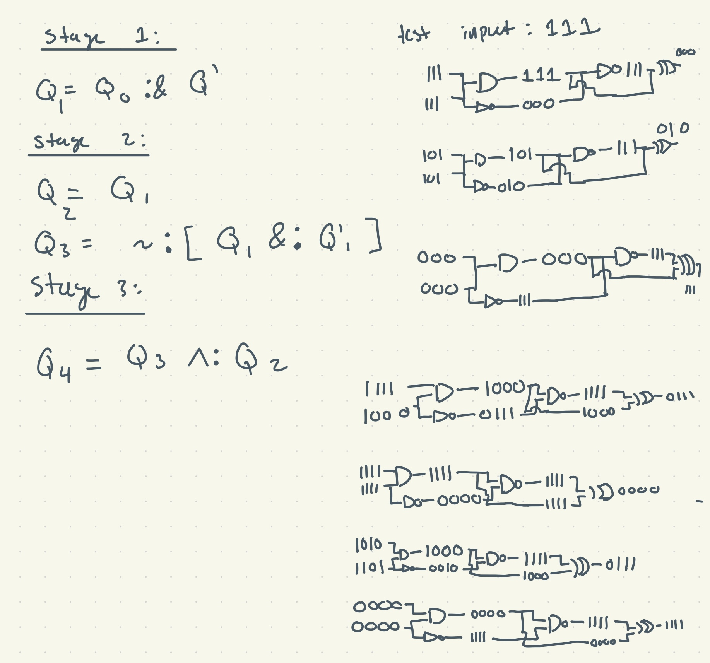
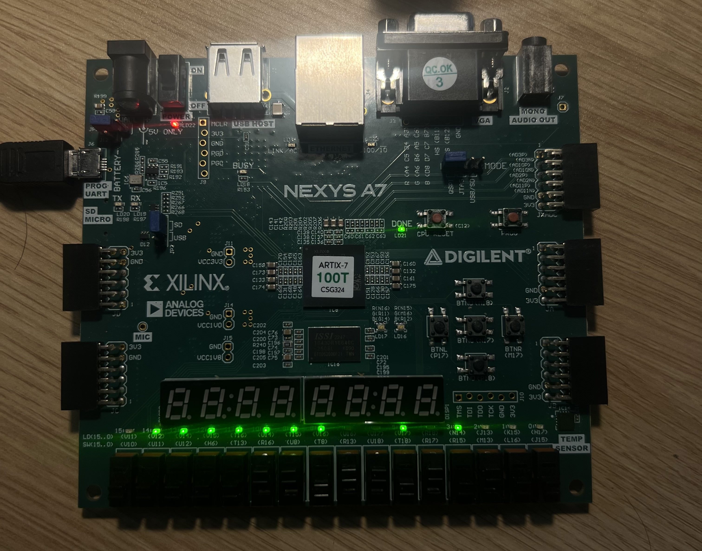

# Week 4: Work on your own
For this week I worked on creating a 3-stage pipeline using DFFs (D Flip Flop). At each stage the DFF would record and save the value from the combinational logic block.

## Overview: 

We have a 3-stage pipeline that goes start off with two 4-bit inputs for two DFFs. Where the first input is controlled by switches `3 to 6` and `7 to 10`. From there those two inputs go through various stages to have the final result stored in the last DFF. It basically goes through an `AND`, `NAND`, and then a `XOR` gate. 

*Note: There is no real pattern, at least that I have taken aware of, these gates were picked at random and therefore have a "random" output.*

## Rough Hand Sketch of Logic:
<div align = "center">
  
</div>
<div align = "center">
  
</div>

> You will see some test cases that I've done by hand. I'll also show an example on the FPGA.

## Modifications: 

  - **../src/counter.ml**
    - ```
      ; d       : 'a [@bits 4]
      ```
      ```
      module O = struct
        type 'a t = { q : 'a [@bits 4]} [@@deriving hardcaml]
      end
      ```
      > Originally, the data input and the output were not defined before, so I defined them to be 4 bits. 
      ```
      let result1 =
        (create
           { I.clock
           ; reset  = switches.:[0, 0]
           ; clear  = switches.:[1, 1]
           ; enable = switches.:[2, 2]
           ; d      = switches.:[6, 3] (*First Data Input*) (*4 Bit*) (*DDF1 = First Value*)
           })
          .q
      in
      let result2 = 
        (create
          { I.clock
          ; reset  = switches.:[0, 0]
          ; clear  = switches.:[1, 1]
          ; enable = switches.:[2, 2]
          ; d      = switches.:[10, 7]   (*Second Data Input*) (*4 Bit*) (*DFF2 = Second Value*)
          })
          .q
      in
      ```
      > Based off the orignial code, I've kept switches `0 to 2` the same, with the change here being switches `6 to 3` are the first 4 bit-input and `10 to 7` being the second 4-bit input. 
      ```
      let result3 = result1 &: result2 in     (*Stage 1: AND GATE*)
      ```
      
      ```
      let result6 = ~:(result5 &: result4) in (*Stage 2: NAND GATE*)
      ```
      ```
      let result9 = result8 ^: result7; in    (*Stage 3: XOR GATE*)
      ```
      > I have set `result3`,`result6`,`result9` to the the results of the `AND`, `NAND`, and `XOR`. However, these are not necessarily the results we want to look at if we want to verfiy the logic. 
      ```
      let result11 = concat_msb [ 
        result10;
        result8;
        result5;
        result4;
        ] in
      ```
      > `result4`,`result5`,`result8` are the DFFs that are holding the results of the `AND`, `NAND`, `XOR` operations. `result4` holds the result of the `AND GATE`, `result5` holds the result of the `NOT` (*compliment of second input*), `result8` holds the result of the `NAND GATE`, and lastly, we have the `XOR GATE` result saved in `result10`.
      > Like the original, they are placed in this `concat_msb` to concatnate the 4-bit results into a 16-bit output. This 16-bit output is then displayed on the FPGA's on board LEDs.
        - LEDs 15-12 = Final Output (XOR)
        - LEDs 11-8  = NAND GATE result
        - LEDs 4-7   = NOT D'
        - LEDs 0-3   = AND GATE result

## FPGA Example: 
> First Input: 1010

> Second Input: 1101
<div align = "center">
  
</div>


